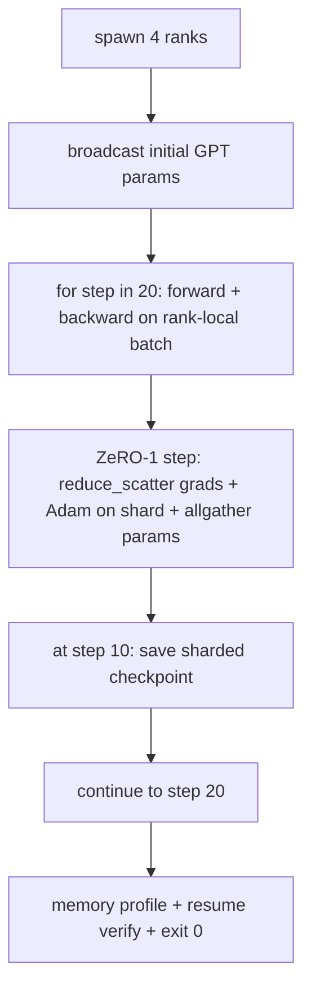

# 端到端分布式训练

> 第 76 至 80 课分别构建了一个组件。本课进行组装：使用 DDP 进行梯度同步、ZeRO-1 进行优化器状态分片，并在中途保存分片检查点，在 4 个模拟 rank 上训练一个微型 GPT。该演示运行 20 步后自动终止，打印损失曲线和内存分析，并写入可恢复的检查点。

**类型：** 构建
**语言：** Python
**前置要求：** 第 19 阶段 C 轨道第 42-49 课
**耗时：** 约 90 分钟

## 学习目标

- 将 DDP（第 77 课）、ZeRO-1（第 78 课）和分片检查点（第 80 课）组合到一个训练循环中。
- 在小型合成语料库上，跨 4 个模拟 rank 训练一个 2 层 Transformer 语言模型，共 20 步。
- 打印每步损失表、每个 rank 的内存分析，以及在相同 world size 下可逐字节恢复的检查点清单。
- 验证组合的正确性：每个组件在前期课程中均可独立测试，本课证明它们能够正确组合。

## 问题背景

综合实战项目（Capstone）是证明各组件能够协同工作的关键。第 76 课实现了集合通信。第 77 课将其封装为 DDP。第 78 课使用 reduce_scatter 对优化器状态进行分片。第 79 课分析了流水线。第 80 课保存了分片检查点。每节课都独立存在并配有各自的测试。真实的训练运行会同时使用所有原语；如果组合有误，损失会发散，检查点无法恢复，或者每个 rank 的内存本应减少却反而增长。

本课运行端到端演示并验证四个不变量：(a) 损失在 20 步内随浮点噪声单调递减，(b) 每个 rank 在每一步都保持相同的参数范数，(c) 每个 rank 的优化器内存等于 ZeRO-1 公式 12P/N 字节，(d) 第 10 步的检查点在重启时可逐字节精确加载。该演示自动终止：20 步，单条命令，exit 0。

## 核心概念



### 微型 GPT

该模型故意设计得很小：2 个 Transformer 块，嵌入维度 32，4 个注意力头，词表大小 64，序列长度 16，批次大小 4。仅几千个参数。足够大以锻炼所有架构连接决策（多头注意力运行标准的掩码路径；LayerNorm 有权重需要同步；LM head 是独立的线性投影，映射回词表）。又足够小，使得在 4 个 CPU rank 上运行 20 步只需几秒钟即可完成。

### 组合规则

| 课程组件 | 负责内容 | 留给循环的内容 |
|--------------|--------------|----------------------------|
| DDP 广播 | 初始参数同步 | 构造时调用一次 |
| ZeRO-1 步骤 | 梯度同步、主副本更新、参数广播 | 每步调用一次，替换 optimiser.step |
| 分片检查点 | 持久化每个 rank 的状态，带 sha256 的清单 | 在 rank 0 上调用，状态通过 allgather 收集 |
| 训练循环 | 前向传播、反向传播、损失日志记录 | 按顺序调用上述三者 |

循环无需了解 reduce_scatter 或 rendezvous 文件。ZeRO 和检查点模块暴露了窄接口，由循环进行组合。

### 为什么使用微型 GPT 而不是 MLP

第 77 课的 MLP 已足以验证梯度同步。微型 GPT 增加了三样东西：词表上独立的 LM head（本课为清晰起见未绑定权重；完整 GPT 通常将 head 与 token 嵌入绑定）、softmax+交叉熵作为损失函数（比 MSE 有更多数值边界情况），以及非对称的前向传播（每层依次进行嵌入、注意力、MLP）。如果在综合实战中坚持使用 MLP，将掩盖组合是否能正确处理 LayerNorm 或嵌入层梯度形状的问题。

### 自动终止意味着 exit 0

循环固定运行 20 步后退出。无需 `while True`，无需人工干预，无需从外部状态恢复。一个可以无人值守运行并在完成后留下完整日志的综合实战项目，证明了系统布线正确。如果任何组件发生死锁，演示将永不返回，测试框架会捕获该问题。

## 构建实现

`code/main.py` 实现了：

- `MiniGPT`：带有掩码自注意力和独立 LM head 的 2 层 Transformer。
- `make_corpus(seed, total_tokens)`：确定性的下一个 token 预测数据。
- `_train_worker`：按 rank 生成；广播初始参数，运行循环，调用 ZeRO 步骤，在第 10 步写入分片检查点。
- `verify_resume`：主运行结束后，在进程内重新加载第 10 步检查点，并断言保存的主分片与内存快照逐字节匹配。
- `main`：编排整个演示，打印损失表、内存分析和验证结果。

运行它：

```bash
python3 code/main.py
```

输出：包含 20 行的损失表、4 行的每 rank 内存分析、检查点清单，以及成功时的 "RESUME VERIFIED" 行。

## 业界生产环境模式

以下三种模式用于完善真实运行中的组合方案。

**每 K 分钟保存检查点，而非每 K 步。** 步长时间随序列长度和微批次数量变化。10 分钟的检查点周期无论模型大小都能捕获相同的计算量。本课为简化使用基于步长的策略；生产环境使用基于挂钟时间的策略。

**尽早检测发散。** 生产环境运行会在反向传播后添加 NaN 防护和损失尖峰检测器；如果单步损失跳跃超过 2 倍，则回滚到上一个检查点，而不是让优化器进入退化状态。本课的损失曲线平滑，因此未使用该防护，但钩子（hook）仍保留。

**跨 rank 聚合内存分析。** 真实运行中各 rank 的内存有所不同（持有最大流水线阶段的 rank 会保留更多激活值）。生产环境记录跨 rank 的最大值和平均值；本课打印每个 rank 的数据以展示公式匹配。

## 应用场景

生产环境模式：

- **DeepSpeed。** 在单一配置下组合 DDP + ZeRO + 流水线 + 激活检查点。本课的组合是 DeepSpeed 架构的微型版。
- **PyTorch FSDP。** 原生等效方案。`FullyShardedDataParallel` 配合 `ShardingStrategy.SHARD_GRAD_OP` 即为 ZeRO-2。
- **NeMo 与 Megatron-LM。** 为超大型模型添加张量并行；否则组合架构相同。

## 交付上线

完整轨道至此结束。这 6 节课共同构成了一个真实团队在采用 DeepSpeed 之前会构建的分布式训练子系统；该抽象已在 gloo 上得到验证，且故障模式已充分演练。第 17 阶段（基础设施与生产）是将此方案部署到真实集群的下一步。

## 练习

1. 添加注意力头的张量并行切分，并验证损失与单 rank 基线匹配。两个 rank：每个 rank 分配一半的注意力头，对注意力输出执行 allreduce。
2. 跨 4 个微批次添加梯度累积，并证明累积梯度等于单个大批次的梯度。
3. 添加从第 10 步恢复的路径，实际继续训练至第 20 步，并产生与原始运行相同的最终损失。
4. 添加指标导出（损失、梯度范数、步长时间）至 JSONL，以便事后可视化运行过程。
5. 添加在损失尖峰时回滚到上一个检查点的 NaN 防护，并通过单步学习率乘子强制制造尖峰以演练回滚机制。

## 关键术语

| 术语 | 常见说法 | 实际含义 |
|------|----------------|------------------------|
| 端到端 | “全部连起来” | 单次运行组合所有组件，而非每个组件单独单元测试 |
| 内存分析 | “每个 rank 的 GB 数” | 每个 rank 为参数、梯度、优化器状态持有的字节数 |
| 恢复契约 | “保存与加载” | 检查点往返后每个 rank 的状态逐字节相等 |
| 自动终止 | “有界运行” | 固定步数，完成时 exit 0，无需人工干预 |

## 延伸阅读

- [DeepSpeed 端到端训练教程](https://www.deepspeed.ai/getting-started/)
- [PyTorch FSDP 高级教程](https://pytorch.org/tutorials/intermediate/FSDP_advanced_tutorial.html)
- [Megatron-LM 训练脚本参考](https://github.com/NVIDIA/Megatron-LM)
- 第 19 阶段第 76-80 课 - 本课组合的各个组件
- 第 17 阶段 - 将组合方案迁移至真实集群
