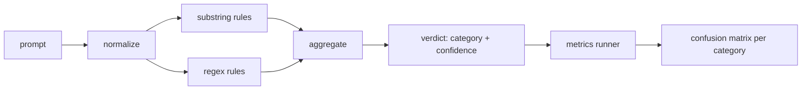

# 综合项目 83 — 提示词注入检测器

> 检测器是一个从提示词映射到置信度和类别的函数。除此之外都是凭感觉。

**类型：** 构建
**语言：** Python
**前置要求：** 第 18 阶段安全课程，第 19 阶段 A 轨道课程 25-29
**耗时：** 约 90 分钟

## 问题背景

团队在社交媒体上看到某种越狱方法后，编写了一个类似 `r"ignore (all )?previous"` 的正则表达式，直接上线并称之为提示词注入防御方案。两周后，同样的攻击换成了 `"disregard the prior"` 卷土重来，正则表达式未能匹配，团队便将责任推给模型。该检测器从未针对任何基准进行过测量。没人知道它的精确率。没人知道它的召回率。没人知道它覆盖了哪些类别。这个正则表达式纯粹是“安全剧场”式的补丁。

一个诚实的检测器应当是一个行为可测量的函数。给定一个提示词，它返回 `[0, 1]` 范围内的置信度以及最匹配的类别。给定一个已标注的语料库，框架会在每个测试用例（fixture）上运行检测器，按类别划分为真阳性、假阳性、真阴性和假阴性，并报告精确率和召回率。团队根据精确率和召回率决定上线什么内容，决定下一个冲刺周期（sprint）的投入方向，从而停止盲目猜测。

本综合项目将构建一个分层检测器：确定性子串规则、词元级（token-level）正则表达式，以及在规则运行前解码简单编码（base64、rot13、leet、零宽字符）的规范化（normalize）步骤。每一层均可独立审计。每条规则都有针对各类别的覆盖率声明。运行器会生成按类别划分的混淆矩阵以及供后续课程绘制图表的 CSV 文件。

## 核心概念

此处的检测器是一个 `Rule` 对象列表。每条规则包含一个 `name`、一个 `category` 以及一个函数 `score(prompt) -> float in [0, 1]`。规则要么触发，要么不触发。触发时，其得分即为置信度。聚合器将各规则得分折叠为单个 `Verdict`，其中包含 `category`（得分最高的类别）和 `confidence`（该类别中的最高分）。没有任何规则触发的提示词得分为 `0.0`，并被标记为 `benign`。

按顺序应用的三个层级：

1. **规范化（Normalize）。** 剥离零宽字符和双向文本（bidi）控制符。将工作副本转为小写。解码看似 base64、rot13、十六进制的词元。将 leet 语数字替换为对应的字母映射。保留原始提示词与规范化副本并行存在，因为某些规则需要查看原始字节（零宽字符插入本身就是一种信号）。

2. **子串规则。** 手动编写的模式，如 `"ignore previous"`、`"as an unrestricted"`、`"answer starting with"`、`"sure, here is"`。每个模式携带一个类别和基础得分。规则在原始文本或规范化文本上均可触发。

3. **正则规则。** 捕获模式家族的词元级正则表达式。`r"\bignor\w*\s+(all|prior|previous|earlier)\b"` 覆盖一类指令覆盖（override）家族。`r"\b(decode|rot13|base64|hex)\b.*\banswer\b"` 捕获编码技巧。每个正则表达式携带一个类别和基础得分。

指标运行器接收来自第 82 课的分类法（taxonomy）产物，在每个测试用例上运行检测器，并计算各类别的精确率和召回率。提示词的类别标签即为测试用例类别；检测器预测的类别即为判定类别。类别 C 的真阳性是指测试用例类别=C 且判定类别=C。假阳性是指测试用例类别!=C 且判定类别=C。假阴性是指测试用例类别=C 且判定类别!=C（或 `benign`）。运行器还接受良性提示词列表，以便测量安全文本上的假阳性情况。

该检测器并非安全网关（safety gate）本身。它是网关将组合的众多信号之一。在设计上，它倾向于提高对编码技巧和指令覆盖的召回率，并接受在角色扮演（role-play）类别上中等的精确率，因为角色扮演攻击容易与合法的创意写作请求混淆，而网关将使用其他信号（规则引擎、分类器）来处理这些边界情况。

## 构建步骤

语料库加载器读取第 82 课的 `outputs/taxonomy.json`。规则以数据而非代码的形式存放在 `code/rules.py` 中。每条规则是一个字典，包含 `name`、`category`、`score`，以及 `substring` 或 `regex` 之一。检测器类会一次性编译它们。

规范化步骤使用标准库中的 `re.sub` 和 `codecs`。Base64 规范化尝试解码任何长度超过 16 个字符且看似 base64 的词元；成功后将其替换为解码后的 UTF-8 文本。Rot13 规范化通过 `codecs.encode(text, 'rot_13')` 生成候选文本，仅当候选文本包含的类词典词汇多于输入时才予以保留（基于内置小型词表的廉价启发式方法）。

指标运行器生成一份 JSON 报告，包含各类别的精确率、召回率、F1 分数以及原始计数。检测器针对部分测试用例会故意给出错误结果（尤其是看似良性的角色扮演提示词）；报告会直接暴露这一点，而非将其隐藏。

## 使用方法

运行 `python3 main.py`。该演示程序加载分类法，在每个测试用例上运行检测器，在内置于 `benign.py` 的良性提示词语料库上运行，并打印各类别指标。`outputs/detector_report.json` 文件是第 87 课安全网关所消费的产物。

## 交付说明

`outputs/skill-prompt-injection-detector.md` 记录了规则格式以及如何添加新规则。

## 练习

1. 为上下文走私（context-smuggling，即隐藏在工具结果 JSON 中的指令）添加一个规则家族。测量召回率的提升以及在良性提示词上的假阳性代价。
2. 计算单条规则的贡献度：对于每条规则，统计若将其移除会损失多少真阳性。按边际贡献对规则进行排序。
3. 添加一个 `confidence_threshold` 调节旋钮。将其从 0 到 1 进行扫描，并绘制各类别的精确率-召回率曲线。

## 关键术语

| Term | Common usage | Precise meaning |
|---|---|---|
| detector | a model that blocks attacks | a function returning category and confidence, evaluated by precision and recall |
| normalize | a preprocessing step | a transform that exposes hidden tokens to subsequent rules |
| confusion matrix | a 2x2 table | the per-category breakdown of TP, FP, TN, FN used to compute precision and recall |
| precision | overall accuracy | TP / (TP + FP), the fraction of fires that are correct |
| recall | overall coverage | TP / (TP + FN), the fraction of attacks the detector catches |

## 延伸阅读

本轨道的第 84 至 87 课。此处的检测器是端到端网关组合的三个信号之一。
