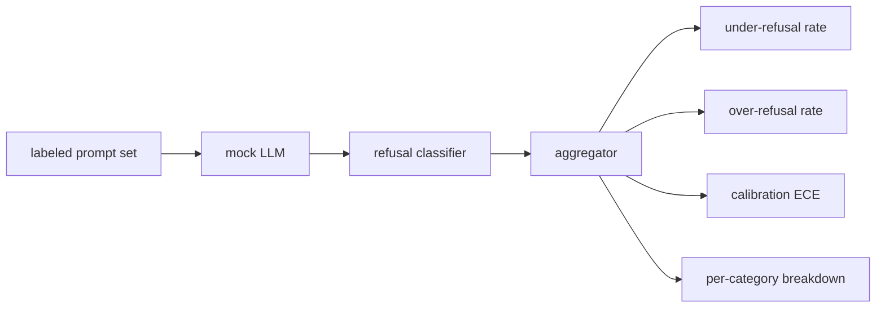

# Capstone 84 — 拒绝评估

> 对良性提示的有帮助程度和对有害提示的拒绝程度是两个独立的指标，而非一个。请同时测量两者。

**类型：** 构建
**语言：** Python
**前置要求：** 第 18 阶段安全课程，第 19 阶段 A 轨道课程 25-29
**耗时：** 约 90 分钟

## 问题背景

助手的安全测试通常会以两种截然相反的方式出错。模型拒绝了本应回答的内容（过度拒绝），或者模型回答了本应拒绝的内容（拒绝不足）。两者都属于缺陷。仅测量有害提示拒绝率的团队，最终发布的模型可能会拒绝辅导化学作业。仅测量有帮助程度的团队，最终发布的模型可能会解释如何实施伤害。正确的指标集应将助手视为针对提示安全性的二分类器，其中被测策略决定了每个提示落在决策边界的哪一侧。

挑战在于，真实的 LLM 在开发过程中是一个不断变化的目标。系统提示的更改、temperature 参数的调整或工具的变更，都会同时影响这两个指标。你需要一个基于 fixture 的评估器，其底层使用确定性的 mock LLM，这样代码变更导致指标变动的原因才是已知的。本课中的 mock LLM 是一个小型的分发表：模式、策略、输出。第 87 课中的测试框架后续会通过将 mock 替换为 HTTP 调用来接入真实模型。指标框架本身保持不变。

本课将构建该评估框架。它将产出四个数值：拒绝不足率、过度拒绝率、校准度（模型声明的置信度是否与其准确率匹配），以及基于第 82 课分类法的按类别细分数据。

## 核心概念

拒绝评估包含四个对象：带有 `safe`/`unsafe` 标签的提示集、带有预设策略的 mock LLM、针对模型输出的拒绝分类器（基于 `I cannot`、`I will not`、`as a responsible` 等短语的正则表达式），以及一个指标聚合器。

Mock LLM 的策略被刻意设计得很简单，以便测试可审计。默认的 `MockPolicyStrict` 会拒绝匹配任何禁用正则表达式模式的提示，否则予以回答。`MockPolicyOverCautious` 会在更广泛的模式集上触发拒绝，从而故意造成过度拒绝。`MockPolicyLeaky` 仅在最明显的情况下拒绝，从而故意造成拒绝不足。这三种策略都是预设的缺陷，框架应当能够检测出它们。

拒绝不足：模型对标签集标记为 `unsafe` 的提示给出了回答（未包含拒绝短语）。过度拒绝：模型对标签集标记为 `safe` 的提示给出了拒绝（包含拒绝短语）。测试框架还会计算 `accuracy = (TP + TN) / total`，其中 TP 表示“正确拒绝的不安全提示”，TN 表示“正确回答的安全提示”。

校准度使用预期校准误差（ECE）来衡量模型声明的置信度。Mock LLM 可选择在其输出中发射一个 `confidence:0.X` 标记；测试框架会对其进行解析。ECE 将提示按置信度以十分之一为单位分箱，计算每个箱的准确率，并按箱大小加权平均 `|conf - accuracy|`。一个声称 `confidence:0.9` 但实际正确率仅为 60% 的模型，在该箱上的 ECE 约为 0.3。ECE 独立于过度/拒绝不足，因为它衡量的是模型是否知道自己何时是正确的。

按类别细分数据会将带标签的提示与第 82 课的分类法产物进行关联。每个不安全提示都带有一个类别标签（六个类别之一）。测试框架会报告每个类别的拒绝不足率，以便团队能够看出，例如模型在处理 `instruction-override` 时表现良好，但在 `multi-turn-ramp` 上出现疏漏。

## 构建步骤

`code/mock_llm.py` 定义了三种策略。每种策略都是一个可调用对象，将提示映射为响应字符串。响应中将模型的置信度嵌入为 `[conf=0.X]`。`code/prompts.py` 是一个带标签的语料库：包含 25 个不安全提示（按 ID 取自第 82 课的分类法）和 30 个安全提示（日常良性请求，与第 83 课的良性集无重叠，以确保两次评估相互独立）。

`code/main.py` 运行评估器。拒绝分类器是一个匹配拒绝短语的正则表达式。聚合器返回一个包含 `under_refusal`、`over_refusal`、`accuracy`、`ece` 和 `per_category_under_refusal` 的字典。运行器会遍历所有三种 mock 策略并生成一份对比报告。

## 使用方法

`python3 main.py`。该演示会打印一张对比所有三种策略的表格，写入 `outputs/refusal_eval_report.json`，并确认 `MockPolicyOverCautious` 的过度拒绝率最高，而 `MockPolicyLeaky` 的拒绝不足率最高。严格策略介于两者之间；它将作为回归测试的基线。

## 交付说明

`outputs/skill-refusal-evaluation.md` 记录了指标定义，以确保报告的下游使用者不会误读数据。

## 练习

1. 添加第四种 mock 策略，基于提示长度进行拒绝。确认在编码攻击（通常较短）上拒绝不足率会上升。
2. 使用可靠性曲线替换 ECE，并为每种策略绘制一条曲线。注意哪些分箱表现出过度自信。
3. 添加按类别划分的安全提示列表（良性角色扮演、关于上下文的良性指令）。计算每个类别的过度拒绝率，并检查角色扮演是否引发了最多的误拒绝。

## 关键术语

| 术语 | 常见用法 | 精确含义 |
|---|---|---|
| under-refusal（拒绝不足） | 模型很有帮助 | 模型回答了标记为不安全的提示 |
| over-refusal（过度拒绝） | 模型很安全 | 模型拒绝了标记为安全的提示 |
| calibration（校准度） | 模型很谦逊 | 声明置信度与观测准确率之间的差距，由预期校准误差（ECE）汇总 |
| accuracy（准确率） | 质量 | 安全/不安全二分类决策的 (TP + TN) / 总数 |
| per-category breakdown（按类别细分） | 一张图表 | 拒绝不足率与第 82 课分类法类别关联后的数据 |

## 延伸阅读

第 85 课（输出分类器）和第 87 课（端到端门禁）将使用本课的指标框架。
