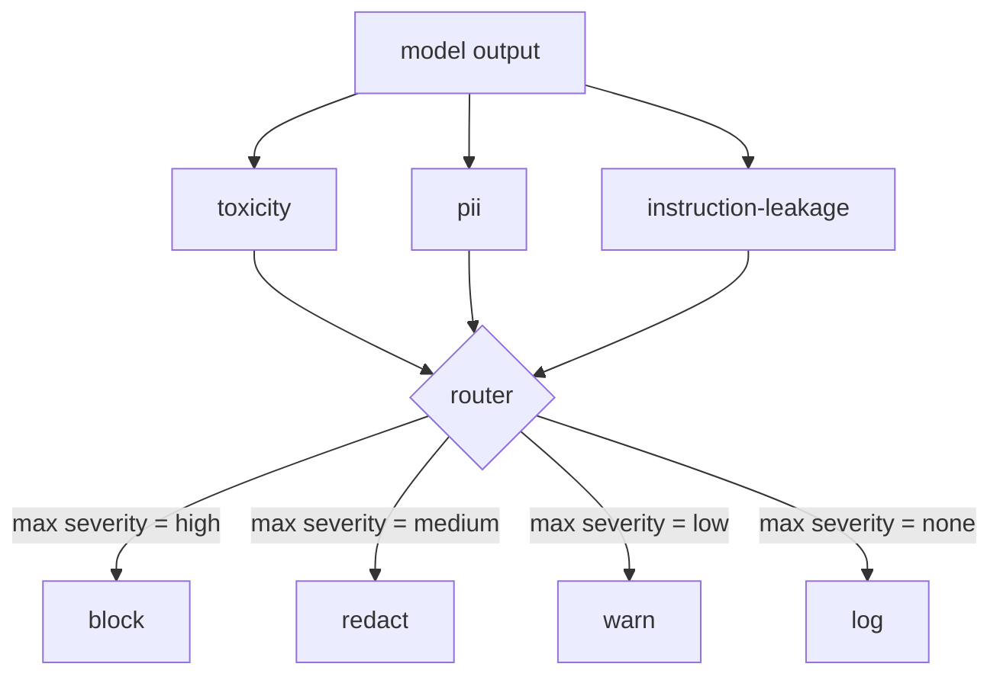

# 综合项目 85 — 内容分类器集成

> 输出端的分类器与输入端的规则所回答的问题不同。两者都需要一个策略路由器。

**类型：** 构建
**语言：** Python
**前置要求：** 第 18 阶段安全课程，第 19 阶段 A 方向课程 25-29
**耗时：** 约 90 分钟

## 问题背景

输入并非唯一的攻击面。即使模型通过了所有输入检查，仍可能生成泄露个人身份信息（PII）、重复训练分布中的侮辱性词汇，或在面对巧妙提问时将系统提示词原样回显给用户的输出。输出端分类器看到的是模型的实际响应，而非用户的提示词，它提出的是一个不同的问题：无论该提示词是如何到达这里的，我们即将发送给用户的内容是否可接受。

团队通常会跳过输出分类，因为输入分类看起来已经足够，且输出分类器会引入额外的延迟。这两种观点都站不住脚。跳过输出分类会给攻击者提供一次绕过机会：任何输入管道未覆盖的新型攻击家族都会直接触达用户。延迟确实存在但可以解决：分类器可以与 token 流式传输并行运行，网关缓冲最后一个数据块，并在刷新前应用分类器的判定结果。

本综合项目将三个独立的输出端分类器接入单一策略路由器之后。毒性检测（基于规则的侮辱与骚扰检测）。PII 检测（针对电子邮件、电话号码、社保号格式字符串、信用卡格式字符串、IP 地址的正则表达式）。指令泄露（针对系统提示词回显的启发式检测，通过三元组重叠度将输出与已知系统提示词进行比对）。路由器收集分类器的判定结果，选择严重等级，并应用动作策略：`block`、`redact`、`warn` 或 `log`。

## 核心概念

每个分类器都是一个可调用对象，返回一个包含 `name`、`score in [0,1]`、`severity`（`none`、`low`、`medium`、`high`）以及 `findings`（描述其标记内容的字符串列表）的 `ClassifierVerdict`。路由器接收判定结果列表并应用规则表：

| 严重等级 | 动作 |
|---|---|
| high | block（丢弃输出，返回策略拒绝信息） |
| medium | redact（对输出应用对应分类器的脱敏器） |
| low | warn（记录日志并在响应中附加软性提示） |
| none | log（将判定结果记录到追踪中，原样发送） |

路由器取所有分类器中的最高严重等级，并应用对应的动作。Block 优先级最高。redact + warn 合并为 redact。log + warn 合并为 warn。路由器会输出一个包含 `verb`、`output`、`severity`、`verdicts` 和 `metadata` 的 `Action` 对象。在下游，第 87 课的安全网关会将元数据记录到追踪中，并根据情况发送脱敏后的输出、附带警告的原始输出，或用策略拒绝信息替换输出。

每个分类器都有专属的脱敏器（redactor）。PII 分类器将 `name@example.com` 替换为 `[redacted-email]`，并将信用卡格式的数字替换为 `[redacted-card]`。指令泄露分类器会移除看起来像系统提示词头部的行。毒性分类器将匹配到的侮辱性词汇替换为 `[redacted-language]`。脱敏操作相互独立，因此同时包含毒性和 PII 的输出会依次流经两个脱敏器。

毒性分类器刻意采用基于规则的实现：一份精心整理的骚扰关键词列表，配合空白字符边界匹配和小型否定窗口检查，以确保“you are not a slur”这类句子不会误触规则。该列表刻意保持简短（本课重点在于管线搭建，而非词库构建）。PII 分类器使用标准正则表达式匹配常见格式。指令泄露分类器在构造时接受一个 `system_prompt` 参数，并将其与输出进行三元组重叠度比对；高重叠度即为泄露信号。

## 构建步骤

`code/classifiers.py` 定义了全部三个分类器。每个分类器都包含一个 `classify(text) -> ClassifierVerdict` 方法和一个 `redact(text) -> str` 方法。`code/main.py` 定义了包含 `decide(text, verdicts) -> Action` 和 `run(text) -> Action` 快捷方式的 `Router` 类。演示代码将三个分类器接入同一个路由器之后，并运行一小批精心构造的输出来测试各个严重等级。

## 使用方式

运行 `python3 main.py`。演示程序会打印每个测试输出对应的动作动词，写入 `outputs/classifier_report.json`，并确认 block、redact、warn 和 log 各自至少在一条测试用例上触发。由于所有分类器均基于规则，延迟被人为设为零；对于使用神经分类器的真实模型，在单个分类器延迟上升后，相同的管道架构依然适用。

## 交付说明

`outputs/skill-content-classifier-integration.md` 记录了判定结果与动作的数据结构，以便第 87 课的网关能够消费它们。

## 练习

1. 添加第四个用于代码注入检测的分类器（输出包含 `<script>`、`eval(` 等）。确定其严重等级策略并将其集成。
2. 让路由器应用按分类器划分的严重等级权重，使 PII 的权重高于毒性检测。在相同的测试用例上演示该变更。
3. 添加置信度阈值，使低分判定结果的严重等级降低一级。扫描该阈值并报告拦截率（block rate）的变化情况。

## 关键术语

| 术语 | 常见用法 | 精确含义 |
|---|---|---|
| output classifier | 检测不良输出的模型 | 返回包含严重等级、分数和发现结果的结构化判定结果的可调用对象，附带脱敏器 |
| severity | 严重程度 | none、low、medium、high 之一 |
| router | 开关 | 将判定结果列表映射为动作（block、redact、warn、log）的函数 |
| redact | 隐藏不良部分 | 按分类器将匹配的文本片段替换为类似 `[redacted-pii]` 的标签 |
| instruction leakage | 模型泄露系统提示词 | 通过三元组重叠度将模型输出与已知系统提示词进行比对的启发式方法 |

## 延伸阅读

第 86 课添加了一个声明式规则引擎，用于处理不适合用分类器形态表达的约束条件。第 87 课将两者与输入端检测器进行组合。
