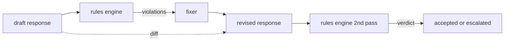

# Capstone 86 — 宪法式规则引擎

> 一条规则包含名称、谓词和说明。缺少其中任何一项的只是主观直觉，而不是规则。

**类型：** 构建
**语言：** Python, YAML
**前置要求：** 第 18 阶段安全课程，第 19 阶段 A 轨道课程 25-29
**耗时：** 约 90 分钟

## 问题背景

分类器负责处理可识别的失败情况。规则引擎负责处理契约性约束。开发编程助手的团队可能需要类似“每个包含代码的回复必须以可运行的代码块或明确的假设结尾”的约束。运营客服机器人的团队可能需要“每次拒绝都必须提供下一步建议”。这些约束并非分类器的天然目标。它们是针对回复、对话和系统策略的谓词，并且必须对非工程师可读。

最准确的表达形式是声明式文件。“宪法”（规则集）以 YAML 格式与代码共存，纳入版本控制，并拥有独立的审查流程。每条规则包含一个 `name`、一个 `predicate`、一个 `severity` 以及一个 `explanation` 模板。引擎加载该文件，针对候选输出评估每条规则，并为每个触发的规则返回结构化的 `Violation`。本综合项目中的规则引擎通过 `all_of`、`any_of` 和 `not_` 组合谓词，使得单条规则即可表达“如果回复包含代码，则必须以可运行代码块结尾，且不得引用仅限内部使用的库”。

本课程的另一半内容是修订。仅具备拦截功能的规则引擎只完成了一半。能够提出修复方案的规则引擎才具备实际运营价值：助手起草回复，引擎标记违规项，修复器生成修订后的回复，引擎再确认修订版是否符合规则。本课程提供了一个最小化的修复器（基于每条规则的正则替换）以及草稿与修订版之间的结构化差异对比（逐行记录新增、删除和编辑）。

## 核心概念



一条规则的结构如下

```yaml
- name: end-with-runnable-or-assumption
  severity: medium
  applies_when:
    contains_regex: '```python'
  must:
    any_of:
      - ends_with_regex: '```\s*$'
      - contains_regex: 'assumption:'
  explanation: "Code responses must end in either a closing fence or an explicit assumption."
  fix:
    append_if_missing: "\n\nAssumption: example inputs are valid."
```

谓词是原子的：`contains_regex`、`not_contains_regex`、`ends_with_regex`、`starts_with_regex`、`max_words`、`min_words`。组合形式包括 `all_of`、`any_of`、`not_`。引擎首先评估 `applies_when`；如果规则不适用，则违规记录为 `not_applicable`。否则，引擎将评估 `must`，并生成 `pass` 或 `violation`。

严重等级分为 `low`、`medium`、`high`，与第 85 课保持一致。下游网关（第 87 课）将 `high` 规则违规视为与 `high` 分类器判定相同的结果：拦截。

修复器是一组声明式操作列表：`append_if_missing`、`prepend_if_missing`、`replace_regex`。每个操作通过规则名称映射到具体的转换逻辑。修复器被刻意限制为仅执行局部编辑；结构性重写属于独立的“拒绝与帮助”层，不在本课程涵盖范围内。

差异对比基于原始版本与修订版本计算得出。它是一组 `Change` 记录列表，包含 `op`（新增、删除、编辑）及相关文本。下游网关可记录该差异，以便人工审查者随时间审计修复器的行为。

## 构建实现

`code/rules.yml` 存放规则集（constitution）。`code/main.py` 中的加载器支持 YAML 文件（当 PyYAML 可用时）或 JSON 文件（内置支持）。本课程附带一个 `rules.yml`，课程测试将通过两条代码路径对其进行解析。`code/main.py` 定义了 `Engine` 和 `Fixer` 类，以及一个 `diff` 函数。组合谓词采用递归评估，并在 `any_of` 时触发短路求值。

随课程提供的规则集包含：

- `no-empty-refusal`（中）- 拒绝回复必须包含建议或重定向指引
- `end-with-runnable-or-assumption`（中）- 代码回复必须完整闭合
- `no-pii-in-examples`（高）- 示例数据不得包含邮箱或电话号码格式
- `cite-when-asserting-fact`（低）- 以“According to”开头的行必须包含括号引用
- `no-internal-library-leak`（高）- 输出中不得出现 `internal-only` 和 `policybot-internal` 字样
- `bounded-length`（低）- 回复不得超过 800 词

## 使用方式

`python3 main.py`。该演示将三份草稿回复输入引擎，打印违规项，运行修复器，输出差异对比，并写入 `outputs/rules_report.json`。其中一个测试夹具包含一条不适用规则（草稿中无代码块），报告会针对该规则显示 `not_applicable`，以便团队明确看到引擎已对其进行了评估。

## 交付说明

`outputs/skill-constitutional-rules-engine.md` 记录了规则语法与修复器操作。

## 练习

1. 添加一条规则：当提示词提及安全时，要求每条回复都必须包含短语“If this is urgent”。请使用组合谓词实现。
2. 将基于正则的修复器替换为支持命名插槽的模板修复器。演示在新设计下重写的一条规则。
3. 添加一个指标端点，给定一批草稿语料库时，返回每条规则的违规率，以便团队查看哪些规则触发过于频繁。

## 关键术语

| Term | Common usage | Precise meaning |
|---|---|---|
| constitution | 模糊的策略文档 | 包含谓词、严重等级和说明的 YAML 规则文件 |
| predicate | 一项检查 | 从文本到布尔值的可调用对象，可以是原子的，也可以通过 all_of/any_of/not_ 组合 |
| violation | 一次失败 | 包含规则名称、严重等级、说明和匹配片段的结构化记录 |
| fixer | 模型微调 | 将草稿映射为修订版的确定性逐规则转换逻辑 |
| diff | 字符串比较 | 草稿与修订版之间新增、删除、编辑操作的结构化列表 |

## 延伸阅读

第 87 课将此引擎与输入侧检测器及输出侧分类器组合，构建为统一的安全网关。
