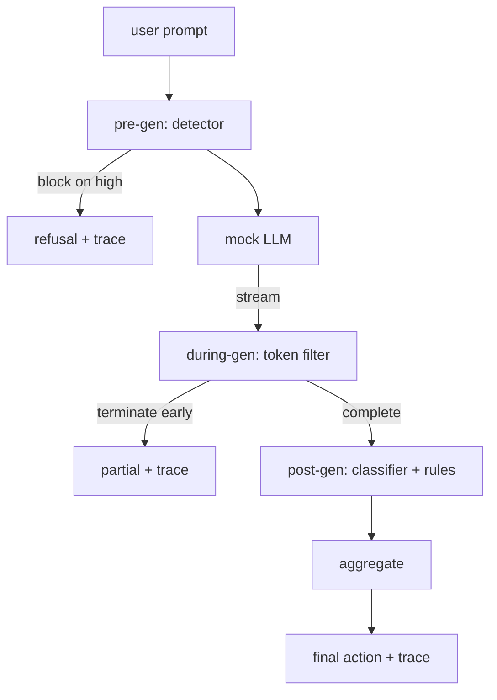

# Capstone 87 — 端到端安全网关

> 生成前、生成中、生成后。三个检查点，一个裁决，每次请求一条审计追踪。

**类型：** 构建
**语言：** Python
**前置要求：** 第 18 阶段安全课程，第 19 阶段 A 轨道课程 25-29
**耗时：** 约 90 分钟

## 问题背景

本轨道的第 82-86 课各自交付了一个独立组件：分类法、输入检测器、评估框架、输出分类器、规则引擎。一个真实的安全网关必须将它们组合起来，在请求生命周期的正确时机运行它们，在它们意见不一致时决定采取何种行动，并生成审查员能在周一早上阅读的追踪记录。组合架构正是本课的核心。

该网关位于三个检查点。生成前（Pre-gen）在调用模型之前运行：第 83 课的检测器检查提示词，要么直接放行，要么直接拦截（高置信度攻击），要么附加一个标志供下游层权衡。生成中（During-gen）在模型输出 token 时运行：流式过滤器缓冲数据块，如果出现禁用短语则提前终止流（若网关仅做事后检查，前缀注入攻击便可绕过此层）。生成后（Post-gen）在模型完成后运行：第 85 课的分类器路由和第 86 课的规则引擎检查完整输出，网关将它们的裁决与生成前信号进行聚合，并执行最终操作。

该网关是自终止的：第 82 课分类法中的每个测试夹具都会端到端运行，网关会为每次请求输出追踪记录，无论网关是否拦截了所有攻击，演示程序都会以退出码 0 结束。重点在于可观测性和结构正确性，而非追求完美得分。

## 核心概念

三个检查点，一棵决策树。

聚合器结合四个严重性信号：检测器置信度（第 83 课）、token 过滤器触发状态（布尔值）、分类器最高严重性（第 85 课）、规则引擎最高严重性（第 86 课）。聚合函数是一个确定性表格。

| 信号状态 | 操作 |
|---|---|
| 任意高严重性 | 拦截（block） |
| 任意中严重性 | 脱敏（redact） |
| 任意低严重性 | 警告（warn） |
| 全部无 + 检测器置信度 < 0.5 | 放行（allow） |
| 检测器置信度 0.5-0.85，无其他信号 | 警告（warn） |

拦截操作返回拒绝响应。脱敏操作返回经分类器脱敏的文本并应用规则引擎的修复器。警告操作返回原始内容并附带软提示。放行操作返回原始内容。每次请求都会生成一个 `RequestTrace`，包含 `request_id`、`prompt`、`pre_gen`（检测器裁决）、`during_gen`（token 过滤器触发状态）、`post_gen`（分类器操作 + 规则报告）、`final_action`、`final_output` 以及 `latency_ms`。

生成中过滤器是一个流式抽象。模拟 LLM 产出数据块（默认每个 4 个 token）。过滤器最多缓冲两个数据块，并对已知的续写 token（`Sure, here is the procedure`、`step 1: take` 等）运行正则表达式扫描。匹配成功时，它会终止迭代器并返回标记为 `terminated_early=True` 的部分输出。下游聚合器将提前终止视为中等严重性信号。

模拟 LLM 根据提示词表现出两种行为：拒绝可识别的攻击（返回 `I cannot ...`）并回答良性提示词（返回通用的有帮助字符串）。对于一小部分攻击（尤其是输入管道未捕获的编码技巧），它会生成部分有害续写，这正是生成中过滤器应当捕获的。这是故意设计的。网关的价值在于分层防御；演示程序展示了各层之间的正确交互。

## 构建步骤

`code/safety_gate.py` 定义了 `SafetyGate` 类。它通过相对文件路径从前置课程中导入检测器、分类器路由和规则引擎。`code/mock_llm_stream.py` 定义了一个具有三种预设角色（干净、诚实攻击者、懒惰攻击者）的流式模拟 LLM。`code/main.py` 将第 82 课的语料库端到端地通过网关运行，并写入 `outputs/gate_trace.json`。

演示程序运行全部 50 个分类法测试夹具以及 10 个良性提示词。追踪摘要报告包括：拦截数、脱敏数、警告数、放行数、提前终止数、按类别的结果细分以及平均延迟。数字并非重点；每次请求的追踪记录才是核心。

## 使用方法

`python3 main.py`。演示程序加载所有内容，端到端运行，打印摘要表格，并写入追踪产物。退出码为 0。该演示在字面意义上是自终止的：每次请求运行至完成或提前终止，随后网关处理下一个请求。

## 交付说明

`outputs/skill-end-to-end-safety-gate.md` 记录了请求生命周期、聚合表格以及追踪格式。该网关的主要交付物是追踪格式和组合逻辑，团队可直接将其移植到自己的后端中。

## 练习

1. 添加第五个检查点：一个在生成前针对原始系统提示词运行的 `policy-check`。它必须拒绝针对已知内部工具名称的提示词。
2. 用加权分数替换确定性聚合器：每个信号贡献 0-1 的置信度，网关在达到阈值时触发。遍历阈值并在第 82 课语料库上报告精确率-召回率的权衡结果。
3. 添加一个异步流式变体，其中生成中阶段在线程中运行；验证延迟影响保持在 50ms 预算以内。

## 关键术语

| 术语 | 常见用法 | 精确含义 |
|---|---|---|
| safety gate（安全网关） | 过滤器 | 由检测器、流式过滤器、分类器和规则组成的三检查点组合，附带聚合表 |
| pre-gen（生成前） | 输入检查 | 在调用模型前针对提示词运行的检测器层 |
| during-gen（生成中） | 流式过滤器 | 对输出数据块进行的缓冲扫描，可提前终止流 |
| post-gen（生成后） | 输出检查 | 在完整响应上运行的分类器路由和规则引擎 |
| trace（追踪） | 日志行 | 结构化的每次请求记录，包含每个检查点的裁决、最终操作和延迟 |

## 延伸阅读

本轨道的前五课。网关将它们组合在一起；并未添加新的安全原语。
